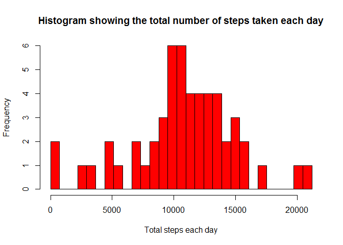
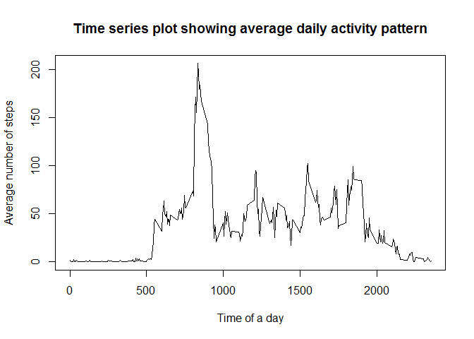
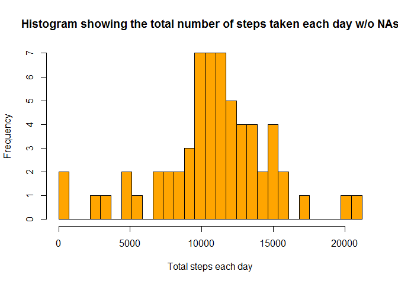
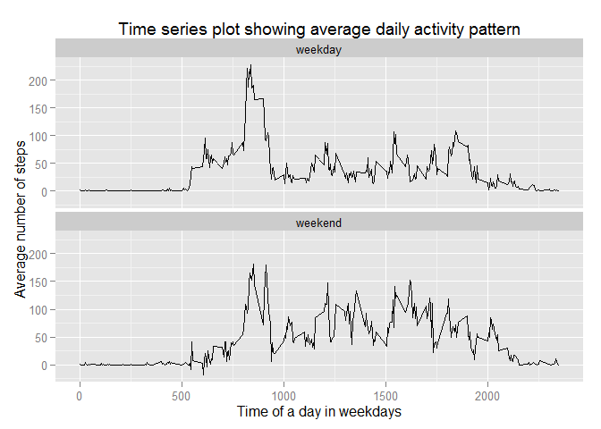

# Reproducible Research Peer Assessment 1
========================================================  
## Introduction
This assignment processes and interprets data collected from a personal activity monitoring device to discuss the pattern of the personal movement.

A group of enthusiasts who take measurements about themselves regularly to improve their health, to find patterns in their behavior, or because they are tech geeks.

A device is deploted to collect the data at 5 minute intervals through out the day. The data consists of two months of data from an anonymous individual collected during the months of October and November, 2012 and include the number of steps taken in 5 minute intervals each day.

## Preparation
### Setting up working environment

* Woking Directory  
A directory named 'repdata' is built as the main working directory of this course. In addition, a subdirectory with the name 'RepData_PeerAssessment1' is cloned from Github ('relebatnebon/RepData_PeerAssessment1'), which corresponds to this assignment.

* Software Packages
To finish the project, a couple of software needs to be installed.   
-- R Version 3.1.3 64bit  
-- RStudio Version 0.98.1102  
-- notepad++ Version 6.7.4  
The following packages in R are expected to be used:  
-- knitr - markdown tools  
-- ggplot2  

### Loading and preprocessing the data

Load the data

The original data is assumed to be placed in the working directory.
(Source:https://d396qusza40orc.cloudfront.net/repdata%2Fdata%2Factivity.zip)


```r
if (!file.exists("activity.csv")) {
  if (!file.exists("activity.zip")) {
    ## warn the missing file
		print("activity.csv and activity.zip not found")
	} else {
    ## unzip if the zip is found instead of the csv
		unzip("activity.zip")
	}
}
```

Specify the data type and read the data


```r
library(methods)
## set the data type of date
setClass("thisDate")
setAs("character", "thisDate", function(from) as.Date(from, format="%Y-%m-%d"))

## read the data with data types specified
activity.withNA <- read.csv("activity.csv",colClasses=c("numeric","thisDate","numeric"))
```

## What is mean total number of steps taken per day?

For this part of the assignment, the missing values in the dataset are ignored.

Make a histogram of the total number of steps taken each day


```r
## get total number of steps taken each day
steps.daily.total <- aggregate(steps ~ date, data = activity.withNA,
  FUN = sum)

## make the histogram
hist(steps.daily.total$steps, col="red",
	breaks=seq(0,10*ceiling(max(steps.daily.total$steps)/10),l=30),
	main="Histogram showing the total number of steps taken each day",
	xlab = "Total steps each day", ylab = "Frequency")
```

 

**The participants most likely took around 9,300 to 13,000 steps every day. The personal movement behaviour shows trends to be normally distributed. **

Calculate and report the mean and median total number of steps taken per day.


```r
avgSteps <- mean(steps.daily.total$steps)
midianSteps <- median(steps.daily.total$steps)
avgSteps; midianSteps
```

```
## [1] 10766.19
```

```
## [1] 10765
```

**The average number of total steps 1.0766189\times 10^{4} and the most frequent number of total steps 1.0765\times 10^{4} are close to each other. It is the mostly likely for the participants to take this amount of steps every day. It may suggest the total number of steps that the participants usually take is predictable. **

## What is the average daily activity pattern?

Make a time series plot (i.e. type = "l") of the 5-minute interval (x-axis) and the average number of steps taken, averaged across all days (y-axis).


```r
## get the average number of steps taken for each interval
steps.intervally.mean <- aggregate(steps ~ interval, 
  data = activity.withNA, FUN = mean)

## make the plot
plot(steps.intervally.mean$interval, steps.intervally.mean$steps, type='l',
	main="Time series plot showing average daily activity pattern",
	xlab = "Time of a day", ylab = "Average number of steps")
```

 

**The major troughs fit into general meal times and rest times, which are sleeping time, breakfast, lunch, afternoon break, and dinner. The daily activity pattern of the participants looks understandable. **

Which 5-minute interval, on average across all the days in the dataset, contains the maximum number of steps?


```r
## get the interval
intervally.max <-steps.intervally.mean$interval[which.max(steps.intervally.mean$steps)]/100

## present it in time format
format(paste(formatC(intervally.max,format="d"),":",100*intervally.max%%1,":00", sep=""),
	format = "%H:%M:%S")
```

```
## [1] "8:35:00"
```

**The participants moved the most during this 5-minute interval. **

## Imputing missing values

Note that there are a number of days/intervals where there are missing values (coded as NA). The presence of missing days may introduce bias into some calculations or summaries of the data.

Calculate and report the total number of missing values in the dataset (i.e. the total number of rows with NAs).


```r
sum(is.na(activity.withNA$steps))
```

```
## [1] 2304
```

**It gives the missing values in the steps column. **


```r
100*sum(is.na(activity.withNA$steps))/nrow(activity.withNA)
```

```
## [1] 13.11475
```

**It gives the portion of the missing values in the steps column. The number of the missing value is significantly large.**

Let's try another way to check the missing values as well as the spread of the dataset.


```r
summary(activity.withNA)
```

```
##      steps             date               interval     
##  Min.   :  0.00   Min.   :2012-10-01   Min.   :   0.0  
##  1st Qu.:  0.00   1st Qu.:2012-10-16   1st Qu.: 588.8  
##  Median :  0.00   Median :2012-10-31   Median :1177.5  
##  Mean   : 37.38   Mean   :2012-10-31   Mean   :1177.5  
##  3rd Qu.: 12.00   3rd Qu.:2012-11-15   3rd Qu.:1766.2  
##  Max.   :806.00   Max.   :2012-11-30   Max.   :2355.0  
##  NA's   :2304
```

**It gives the missing values as well as the quartiles in the dataset. **

As there are quite a lot of missing values, they may pose bias on the analysis. To reduce the impact, let's fill in all of the missing values in the dataset.

As the personal movement data shows a reasonable possibility in a general daily movements, it is assumed that the total numnber of steps taken each day follows a normally distributed pattern. Therefore **a random number following a normal distribution with the respective mean and standard deviation **, which are stemmed from the observed data, is used for each missing value as the strategy.

Create a new dataset that is equal to the original dataset but with the missing data filled in.


```r
## get the standard deviations
steps.intervally.stddev <- aggregate(steps ~ interval, 
  data = activity.withNA, FUN = sd)

## create a dataset, i.e. the 
activity.withoutNA <- activity.withNA

## fill in the missing value
for (i in 1:nrow(activity.withoutNA)){
  if (is.na(activity.withoutNA$steps[i])){
    ## find the interval
		key.interval <- activity.withoutNA$interval[i]
    ## get the mean
		key.row <- which(steps.intervally.mean$interval == key.interval)
		key.mean <- steps.intervally.mean$steps[key.row]
    ## get the standard deviation
		key.row <- which(steps.intervally.stddev$interval == key.interval)
		key.stddev <- steps.intervally.stddev$steps[key.row]
    ## generate the random number with normal distribution
		key.steps <- rnorm(1,mean=key.mean,sd=key.stddev)
    ## fill the random number in the missing value
		activity.withoutNA$steps[i] <- key.steps
	}
}
```

Make a histogram of the total number of steps taken each day


```r
## get the total number of steps each day in the filled dataset
steps.withoutNA.daily.total <- aggregate(steps ~ date, data = activity.withoutNA,
	FUN = sum)

## make the histogram
hist(steps.withoutNA.daily.total$steps, col="orange",
	breaks=seq(0,10*ceiling(max(steps.withoutNA.daily.total$steps)/10),l=30),
	main="Histogram showing the total number of steps taken each day w/o NAs",
	xlab = "Total steps each day", ylab = "Frequency")
```

 

Calculate and report the mean and median total number of steps taken per day.


```r
mean(steps.withoutNA.daily.total$steps)
```

```
## [1] 10835.94
```

```r
median(steps.withoutNA.daily.total$steps)
```

```
## [1] 11015
```

Do these values differ from the estimates from the first part of the assignment? What is the impact of imputing missing data on the estimates of the total daily number of steps?

Let's look at the percentage change on the 2 numbers.


```r
100*(mean(steps.withoutNA.daily.total$steps)-mean(steps.daily.total$steps))/mean(steps.daily.total$steps)
```

```
## [1] 0.6479049
```

```r
100*(median(steps.withoutNA.daily.total$steps)-median(steps.daily.total$steps))/median(steps.daily.total$steps)
```

```
## [1] 2.322341
```

**The filled dataset has the mean and median slightly changed. ** Sometimes there might be increase or decrease but the changes are not significant. 

**Therefore the mising values did not pose significant impact on the dataset although there are quite a lot of them, providing the normal distribution assumption is fair. **

## Are there differences in activity patterns between weekdays and weekends?

The dataset with the filled-in missing values is used for this part.

Create a new factor variable in the dataset with two levels "weekday" and "weekend" indicating whether a given date is a weekday or weekend day.


```r
## get day of the week
activity.withoutNA$weekday <- as.POSIXlt(activity.withoutNA$date)$wday

## create the dayofweek variable to show whether it is a weekday/weekend
activity.withoutNA$dayofweek <- "weekday"
for (i in 1:nrow(activity.withoutNA)){
  if(activity.withoutNA$weekday[i] == 0 | activity.withoutNA$weekday[i] ==6) {
    activity.withoutNA$dayofweek[i] <- "weekend"
  }
  }
```

Make a panel plot containing a time series plot (i.e. type = 'l') of the 5-minute interval (x-axis) and the average number of steps taken, averaged across all weekday days or weekend days (y-axis).


```r
## set the variable as factor
activity.withoutNA$dayofweek <- as.factor(activity.withoutNA$dayofweek)

## get the total number of steps and split the data by the dayofweek variable
steps.withoutNA.intervally.mean <- aggregate(steps ~ interval + dayofweek, 
  data = activity.withoutNA, FUN = mean)

## make the plot
library(ggplot2)
qplot(interval, steps, data=steps.withoutNA.intervally.mean, geom=c("line"), 
  main="Time series plot showing average daily activity pattern",
	xlab = "Time of a day in weekdays", ylab = "Average number of steps") + facet_wrap(~ dayofweek, ncol=1)
```

 

During weekdays, ** the peaks and troughs are sharp **. The participants moved the most in the morning. The movement level was almost one third during the other peak intervals. ** The major troughs demonstrated a strong fit to general meal times and rest times. **

During the weekends, such a fitting to meals and rests is weaker. ** The movement level is higher throughout the day **. Nevertheless it is just above one half of the highest level during the weekdays.

**During the weekdays, the participants took the most steps in the mornings for the whole week.**

**During the weekends, the participants took more steps throughout the day yet the number they took less then the weekday mornings.**

**Regardless of the days of the week, the participants shows a likelihood that their movement level fit to the meal and break times - as they eat or rest, they move less. **
